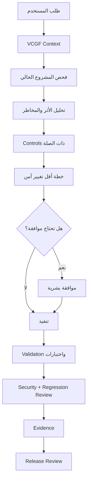
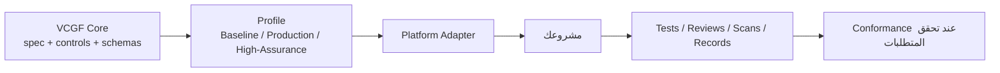

<!--
VCGF — Vibe Coding Governance Framework
SPDX-FileCopyrightText: 2026 Eng. Hamada Sami
SPDX-License-Identifier: Apache-2.0
Founder & Maintainer: Eng. Hamada Sami
Email: i@hamada.io
GitHub: https://github.com/Vibe-Coding-Commons
-->

# VCGF — Vibe Coding Governance Framework

[English → README.md](README.md)

  

**طوّر أسرع بالذكاء الاصطناعي — من غير ما تفقد السيطرة على الأمان والمعمارية والبيانات وجودة الإصدار.**

VCGF هو إطار مفتوح ومحايد تجاه المنصات يجمع **Governance + Security + Privacy + Engineering** لتنظيم تطوير البرمجيات بمساعدة الذكاء الاصطناعي. الفكرة بسيطة: بدل أن تطلب تعديلًا فتبدأ أداة الـAI في تغيير المشروع مباشرة، يجعل VCGF الأداة تفهم المشروع أولًا، وتفحص الموجود، وتحلل أثر التغيير ومخاطره، وتستخدم القواعد الأمنية والهندسية المناسبة، وتتوقف للموافقة البشرية عند الحاجة، ثم تختبر وتترك Evidence قبل اعتبار المهمة مكتملة.

> **ابدأ من هنا:** [البدء خلال 5 دقائق](#البدء-خلال-5-دقائق) · [اختر منصتك](#منصات-ai-coding-المدعومة) · [تثبيت-vcgf](#تثبيت-vcgf) · [دليل الاستخدام اليومي](docs/user-guide.md) · [المواصفة التقنية](spec/VCGF-CORE.md)

## المحتويات

- [ما هو VCGF؟](#ما-هو-vcgf)
- [لماذا تم إنشاء VCGF؟](#لماذا-تم-إنشاء-vcgf)
- [ماذا يتغير عند استخدام VCGF؟](#ماذا-يتغير-عند-استخدام-vcgf)
- [أهداف VCGF](#أهداف-vcgf)
- [البدء خلال 5 دقائق](#البدء-خلال-5-دقائق)
- [منصات AI Coding المدعومة](#منصات-ai-coding-المدعومة)
- [تثبيت VCGF](#تثبيت-vcgf)
- [اختيار Profile](#اختيار-profile)
- [ماذا يحتوي VCGF؟](#ماذا-يحتوي-vcgf)
- [مقارنة القدرات قبل وبعد VCGF](#مقارنة-القدرات-قبل-وبعد-vcgf)
- [أمثلة عملية](#أمثلة-عملية)
- [قبل VCGF مقابل مع VCGF](#قبل-vcgf-مقابل-مع-vcgf)
- [كيف يعمل VCGF؟](#كيف-يعمل-vcgf)
- [كيف أعرف أن VCGF فعال؟](#كيف-أعرف-أن-vcgf-فعال)
- [هل يجب أن أكون مبرمجًا؟](#هل-يجب-أن-أكون-مبرمجًا)
- [ما الذي لا يفعله VCGF؟](#ما-الذي-لا-يفعله-vcgf)
- [ما النتائج المتوقعة؟](#ما-النتائج-المتوقعة)
- [التفاصيل التقنية](#التفاصيل-التقنية)
- [خريطة المستودع](#خريطة-المستودع)
- [التحقق الآلي](#التحقق-الآلي)
- [الحوكمة والمساهمة والإبلاغ الأمني](#الحوكمة-والمساهمة-والإبلاغ-الأمني)
- [الترخيص والمؤسس](#الترخيص-والمؤسس)

# ما هو VCGF؟

بأبسط وصف: **VCGF هو مجموعة قواعد ودورة عمل تجعل استخدام أدوات AI Coding أكثر انضباطًا وأمانًا وقابلية للمراجعة.**

هو ليس AI Model، وليس Coding Tool، وليس IDE، وليس Security Scanner، ولا بديلًا عن المطورين. أنت تضيفه إلى طريقة عملك مع Lovable أو Claude Code أو Bolt أو v0 أو Replit أو Cursor أو أي أداة أخرى.

VCGF يجمع ثلاثة محاور:

- **Governance:** الأداة تفهم المشروع، تشرح الأثر والمخاطر، تلتزم بالنطاق، وتتوقف للموافقة في التغييرات الحساسة.
- **Security & Privacy:** التعديلات تراعي Authentication وAuthorization والـValidation والبيانات الشخصية والأسرار وقاعدة البيانات والملفات والـAPIs وغيرها.
- **Engineering Discipline:** كل تغيير مهم يجب أن يكون قابلًا للاختبار والمراجعة والتتبع، ومعه Evidence يثبت ما تم التحقق منه.

**Control** يعني قاعدة داخل VCGF تحدد شيئًا يجب على المشروع الالتزام به. **Adapter** هو الجزء الذي يترجم قواعد VCGF العامة إلى طريقة استخدام تناسب منصة معينة. **Profile** يحدد مجموعة الـControls المطلوبة بحسب حساسية المشروع.

# لماذا تم إنشاء VCGF؟

أدوات الذكاء الاصطناعي سريعة جدًا، لكن الطلب القصير قد يؤدي إلى تغييرات أكبر بكثير مما يتوقعه المستخدم.

### مثال: «أضف استرجاع كلمة المرور»

بدون منهجية، قد ينشئ الـAI صفحة وEndpoint ويعتبر العمل انتهى، لكنه ينسى منع كشف ما إذا كان البريد مسجلًا، أو Expiration للـToken، أو Single Use، أو Rate Limiting، أو التخزين الآمن للـToken، أو التعامل مع Sessions القديمة وMFA.

مع VCGF، يفحص الـAI نظام Authentication الحالي أولًا، ويحدد الملفات والـTrust Boundaries المتأثرة، ويربط المهمة بقواعد Password Recovery والـValidation، ويحدد الاختبارات، ويتوقف للموافقة إذا كان التغيير حساسًا.

### مثال: «أضف Admin Role»

إخفاء زر في الواجهة ليس Authorization. VCGF يجعل الأداة تفحص أين تُفرض الصلاحيات في الـAPI/Server/Database، وتختبر الوصول المسموح والمرفوض.

### مثال: «اسمح للعملاء برفع ملفات»

التنفيذ السريع قد يقبل أي ملف أو يجعل التخزين Public أو يسمح لمستخدم برؤية ملف مستخدم آخر. VCGF يُدخل File Validation وPrivate Access وAuthorization وSafe Naming والحجم والنوع وصلاحيات التحميل والتنزيل في الخطة من البداية.

الهدف ليس إبطاء الذكاء الاصطناعي؛ الهدف أن تكون التغييرات المهمة **مقصودة ومفهومة** بدل أن تكون مفاجآت.

# ماذا يتغير عند استخدام VCGF؟

بدون VCGF: تكتب الطلب → يبدأ الـAI في التعديل → تكتشف الآثار الجانبية لاحقًا.

مع VCGF، التغيير الحساس يُفترض أن يمر بهذا المسار:

1. قراءة قواعد المشروع والـContext.
2. فحص التنفيذ الحالي.
3. تحديد الكود وقاعدة البيانات والـAPIs والصلاحيات والملفات والتكاملات والاختبارات المتأثرة.
4. تصنيف المخاطر واختيار الـControls المناسبة.
5. تقديم خطة Minimum Safe Change.
6. التوقف للموافقة البشرية إذا كان التغيير حساسًا.
7. تنفيذ النطاق الموافق عليه فقط.
8. Validation واختبارات نجاح وفشل/رفض الوصول حسب الحالة.
9. Security Review وRegression Review.
10. حفظ Evidence وذكر أي Findings متبقية قبل Release.



# أهداف VCGF

| الهدف | ماذا يعني؟ | لماذا مهم؟ | النتيجة المتوقعة |
|---|---|---|---|
| Security | التغييرات الحساسة تستخدم قواعد واضحة بدل الاختصارات. | قد يصلح الـAI وظيفة ويضعف Trust Boundary. | تغييرات أكثر أمانًا في Auth/API/DB/Files/Secrets. |
| Governance | تحليل أثر ومخاطر وبوابات موافقة واضحة. | المستخدم يحتاج تحكمًا في التغييرات واسعة التأثير. | مفاجآت أقل وقرارات أوضح. |
| Predictability | Context وقواعد مستمرة تقلل الافتراضات الصامتة. | نفس الطلب لا يجب أن يعيد اختراع المعمارية. | تنفيذ أكثر اتساقًا. |
| Architecture Protection | المعمارية الحالية Contract ما لم يتم اعتماد تغييرها. | Refactoring العشوائي يسبب Architecture Drift. | إعادة تصميم غير مطلوبة أقل. |
| Data Protection | البيانات الشخصية تُجمع وتحمى وتُحتفظ بها بشكل مقصود. | حقل حساس صغير قد يرفع أثر الاختراق. | قرارات أفضل للتشفير والخصوصية. |
| Safe AI Changes | Inspect first ومنع Hallucinated APIs/Packages. | الكود المولد قد يعتمد على شيء غير موجود أو خطِر. | كود أكثر ارتباطًا بالواقع. |
| Quality | الاختبار والـValidation جزء من Definition of Done. | ظهور الصفحة لا يثبت صحة النظام. | Regression أقل. |
| Traceability | القرارات مرتبطة بـControls وEvidence. | يجب معرفة لماذا وكيف تم التحقق. | مراجعة وتدقيق أسهل. |
| Human Control | التغييرات عالية المخاطر تتوقف للموافقة. | بعض القرارات لا ينبغي تفويضها ضمنيًا. | تحكم أفضل في Auth/Data/Production/Payments. |
| Production Readiness | Release/Monitoring/Recovery/Incident Response ضمن المنهجية. | Secure Coding وحده لا يكفي. | إصدار وتشغيل أكثر انضباطًا. |

# البدء خلال 5 دقائق

1. **حمّل VCGF** من GitHub أو Release ZIP.
2. **اختر منصتك** من [`docs/platform-guides/`](docs/platform-guides/README.md).
3. **اختر Profile:** Baseline أو Production أو High-Assurance.
4. **املأ Project Context** من [`templates/project-context/project-context.md`](templates/project-context/project-context.md).
5. **ثبت Rule/Instruction الخاص بالمنصة** حسب الدليل.
6. **ابدأ Session جديدة** وأرسل First Session Message الموجود في دليل المنصة.
7. **تحقق أن VCGF فعال** بطلب Version/Profile/Adapter/Context/Approval Gates من الـAI.
8. **اطلب أول تغيير** وتأكد أنه يفحص ويخطط قبل التنفيذ الحساس.

بعد التثبيت استخدم [`docs/user-guide.md`](docs/user-guide.md) كدليل يومي.

# منصات AI Coding المدعومة

| المنصة | Adapter | الحالة | لمن؟ | الدليل |
|---|---|---|---|---|
| Generic | `generic` 1.0.0 | stable | Any AI coding tool without a dedicated VCGF adapter | [دليل الإعداد](docs/platform-guides/generic.md) |
| Lovable | `lovable` 1.0.0 | stable | Lovable builders using Workspace/Project Knowledge and repository context | [دليل الإعداد](docs/platform-guides/lovable.md) |
| Claude Code | `claude` 1.0.0 | stable | Developers using Claude Code in a local or repository-based workflow | [دليل الإعداد](docs/platform-guides/claude.md) |
| Bolt | `bolt` 1.0.0 | stable | Bolt users who want persistent project guidance through Project Knowledge | [دليل الإعداد](docs/platform-guides/bolt.md) |
| v0 | `v0` 1.0.0 | stable | v0 users working with reusable Instructions, Plan Mode, Projects, and optional GitHub review | [دليل الإعداد](docs/platform-guides/v0.md) |
| Replit | `replit` 1.0.0 | stable | Replit Agent users working inside a Replit project | [دليل الإعداد](docs/platform-guides/replit.md) |
| Cursor | `cursor` 1.0.0 | stable | Cursor Agent / IDE users who want version-controlled project rules | [دليل الإعداد](docs/platform-guides/cursor.md) |

الحالة مأخوذة من `adapter.yaml` لكل منصة. حالة الـFramework لا تُفرض تلقائيًا على أي Adapter مستقبلي.

# تثبيت VCGF

## مسار المبتدئ — بدون Git

1. حمّل ZIP من GitHub.
2. فك الضغط.
3. افتح `docs/platform-guides/README.md`.
4. اختر منصتك.
5. اختر Profile من `profiles/`.
6. أكمل Project Context.
7. انسخ أو الصق أو ارفع فقط الملفات التي يطلبها دليل منصتك.
8. ابدأ Session جديدة ونفذ اختبار التفعيل.

لا تحتاج إلى وضع جميع ملفات الـ84 Control داخل كل Chat.

## مسار المطور — Git

```bash
git clone https://github.com/Vibe-Coding-Commons/VCGF.git
cd VCGF
python -m pip install -r requirements-dev.txt
python scripts/release-quality-gate.py
```

بعد ذلك اتبع [دليل منصتك](docs/platform-guides/README.md). Git مفيد للـVersioning وCI لكنه ليس شرطًا لاستخدام Workflow الأساسي.

# اختيار Profile

| Profile | اختره عندما... | Controls المطلوبة في v1.0.0 |
|---|---|---:|
| **Baseline** | Prototype أو تجربة أو PoC منخفض المخاطر. | 25 |
| **Production** | مستخدمون حقيقيون أو بيانات أعمال أو خدمة Internet/Production. | 77 |
| **High-Assurance** | نظام مؤسسي حساس أو منظم أو عالي الأثر. | 84 (جميع Controls) |

الـProfile ليس باقة تسويقية؛ هو يغير المتطلبات والـEvidence المطلوبة. المصدر Canonical هو `profiles/<profile>/profile.yaml`.

# المصطلحات المهمة

- **Control:** قاعدة تحدد شيئًا يجب/لا يجب/ينبغي على المشروع فعله.
- **Adapter:** يترجم قواعد VCGF العامة إلى طريقة استخدام مناسبة للمنصة.
- **Profile:** مجموعة Controls مطلوبة حسب مستوى المخاطر.
- **Evidence:** دليل يثبت أن التغيير أو الـControl تم اختباره أو مراجعته فعلًا.
- **Conformance:** إثبات منظم بأن المشروع طبق متطلبات Version/Profile/Adapter محددة ومعه Evidence وExceptions موثقة.
- **Exception:** استثناء معتمد ومؤقت لـControl مع Risk Owner وCompensating Controls وتاريخ انتهاء ومراجعة.
- **Normative:** Requirement يستخدم MUST/MUST NOT/SHOULD/SHOULD NOT/MAY بصورة معيارية.

راجع [`docs/terminology.md`](docs/terminology.md) للتفاصيل.

# ماذا يحتوي VCGF؟

## 1. AI Governance والتحكم في التغييرات

**ماذا يفعل؟**  
Inspect Before Generate، منع Silent Assumptions، Change Impact Analysis، Minimum Safe Change، منع Architecture Drift وUnauthorized Refactoring وUnrequested Features، إدارة Persistent Context، منع Hallucinated APIs/Packages، Human Approval Gates، ومقاومة Prompt/Tool Injection ومحاولات إضعاف Security Controls.

**لماذا مهم؟**  
الـAI قد يغيّر أشياء كثيرة بثقة رغم نقص الـContext.

**مثال:**  
تطلب تقريرًا جديدًا، فيكتشف الـAI خدمة Reports الحالية ويعيد استخدامها بدل إنشاء Data Access Pattern ثانية.

**النتيجة:**  
تغييرات عشوائية أقل وخطة أوضح قبل المخاطر.

## 2. Authentication وAuthorization وRBAC/ABAC وSessions وMFA

**ماذا يفعل؟**  
يغطي Authentication Baseline، مقاومة Brute Force/Enumeration، Password Storage، Password Recovery، MFA/Session Security، Privileged Access، Object-Level Authorization، RBAC/ABAC، Tenant Isolation، وإنفاذ الصلاحيات على Trusted Layer.

**لماذا مهم؟**  
إخفاء زر ليس Authorization.

**مثال:**  
إضافة Admin تتطلب فحص API/Server/Database واختبار أن المستخدم العادي مرفوض فعلًا.

**النتيجة:**  
عزل صلاحيات وبيانات أقوى.

## 3. Input/Field Validation وOutput Encoding وInjection Protection

**ماذا يفعل؟**  
يفرض Critical Field Validation على Trusted Layer، Output Encoding/Sanitization، وحماية من SQL/NoSQL-style Injection وCommand Injection وTemplate Injection وXSS وPath/Header/Formula Injection.

**مثال:**  
National ID أو Amount لا يعتمد فقط على Regex في الواجهة، بل Type/Format/Range/Business Validation في طبقة موثوقة.

**النتيجة:**  
مدخلات ضارة أو غير صحيحة أقل وصولًا للـBusiness Logic والـDatabase.

## 4. API وCSRF/SSRF/CORS وRate Limiting وWebhooks

**ماذا يفعل؟**  
يعامل الـAPI/Server Functions كحدود أمنية مستقلة، مع Business Logic Integrity وAbuse Prevention وSSRF/CSRF/CORS وWebhook/Third-Party Integration Security.

**النتيجة:**  
لا تعتمد حماية الـEndpoint على أن الواجهة «لن تستدعيه» بطريقة خاطئة.

## 5. File Upload وPrivate File Access

**ماذا يفعل؟**  
Validation للحجم والنوع والاسم والمحتوى المتوقع، Private-by-Default عند الحاجة، Authorization، Safe Paths، وصلاحيات Download/Access.

**النتيجة:**  
رفع وتنزيل ملفات أكثر أمانًا وعزلًا بين المستخدمين.

## 6. Database Governance وIntegrity وTransactions وConcurrency

**ماذا يفعل؟**  
Schema Change Governance، Constraints، Migration Safety، Transactions، Race/Concurrency، RLS/Data-Layer Security حيث ينطبق، وSecure Query Patterns.

**النتيجة:**  
Migrations أكثر توافقًا ومفاجآت أقل للبيانات.

## 7. Encryption وKey Management وPII/Privacy وRetention/Delete

**ماذا يفعل؟**  
Data Classification، Minimization/Purpose Limitation، PII Protection، Field-Level Encryption عند الحاجة حسب Threat Model، Key Rotation، Log Redaction، Retention، Secure Deletion، Backup/Export Protection، وPersonal Data Incident Handling.

**مثال:**  
إضافة رقم هوية تبدأ بسؤال «هل نحتاج تخزينه؟» ثم التصنيف والوصول والتشفير والبحث والاحتفاظ والحذف.

**النتيجة:**  
حماية بيانات أكثر مقصودية بدل تخزين كل شيء كـPlaintext لمجرد السهولة.

## 8. Secrets وEnvironments وProduction Protection

يمنع وضع Secrets في Frontend أو Prompts أو Repository أو Logs أو URLs، ويفصل بيئات التطوير/الاختبار/الإنتاج حيث يتطلب المشروع ذلك.

## 9. Dependencies وSupply Chain وSBOM

يراجع ضرورة الـDependency ومصدرها وLockfile والـVulnerabilities ومخاطر Hallucinated Packages، ويدعم Dependency Inventory/SBOM.

## 10. Audit Logging وTamper Resistance وSecure Errors وMonitoring

يسجل الأحداث المهمة دون تسريب Passwords/Tokens/PII غير الضرورية، ويغطي Monitoring/Alerting وSecure Errors وأدلة التحقيق.

## 11. Security/Regression Testing وRelease وRollback وBackup/Recovery وIncident Response

لا يعتبر Preview ناجحًا Definition of Done. يوجد Security Testing وNegative Tests وRegression Testing وRelease Gates وRollback Readiness وArtifact Integrity/Provenance وBackup/Recovery وIncident Response.

## 12. Evidence وExceptions وConformance وProfiles وAdapters وAutomation

VCGF ليس Documentation فقط. يحدد Evidence Model وException Management وConformance، ويستخدم Profiles وAdapters، ويضم Validators وGitHub Actions لاكتشاف أخطاء البنية والـIDs والـMappings والروابط والإصدارات والـAttribution.


## خريطة التغطية باختصار

الأقسام السابقة مجمعة لسهولة القراءة، لكن VCGF v1.0.0 يغطي فعليًا القدرات التالية:

| المجال | التغطية |
|---|---|
| AI Governance | AI Context Management، Prompt Governance، Persistent Project Context، Inspect Before Generation، Impact/Risk Analysis، Human Approval Gates، Minimum Safe Change، Architecture Drift، Silent Assumptions، Unauthorized Refactoring، Unrequested Features، Hallucinated APIs/Dependencies، Prompt/Tool Injection، Security Control Protection |
| Identity & Access | Authentication، Authorization، RBAC، ABAC، Object-Level Authorization، Tenant Isolation، Sessions، MFA، Password Security، Secure Recovery، Brute Force/Enumeration Resistance، Privileged Access |
| Input/Browser Security | Input Validation، Critical Field Validation، Output Encoding/Sanitization، SQL/Query Injection، Command Injection، Template Injection، XSS، CSRF، SSRF، CORS |
| API & Integrations | API/Server Function Security، Business Logic Integrity، Rate Limiting، Webhooks، Third-Party Integration Security |
| Files | File Upload Security، Type/Size/Filename Safety، Private File Access، Download Authorization |
| Database | Change Governance، Integrity، Secure Queries، RLS/Data-Layer Enforcement حيث ينطبق، Transactions، Concurrency/Race Handling، Migration/Rollback |
| Data & Privacy | Encryption، Field-Level Encryption، Key Management/Rotation، PII، Privacy، Classification، Minimization/Purpose Limitation، Retention، Secure Deletion، Backup/Export Protection، Log Redaction |
| Secrets/Environments | Secrets Management، Environment Variables، Environment Separation، Production Protection، Secure Configuration |
| Supply Chain | Dependency Governance، Hallucinated Package Defense، Provenance، Vulnerability Review، Lockfiles، SBOM/Dependency Inventory |
| Audit/Operations | Audit Logging، Tamper Resistance عند الحاجة، Secure Errors، Monitoring/Alerting، Configuration Drift، Backup/Recovery، Incident Response |
| Testing/Release | Security/Negative/Regression Testing، Definition of Done، Release Gates، Rollback Readiness، Artifact Integrity/Provenance |
| Framework Governance | Evidence، Exceptions، Conformance، Profiles، Adapters، Machine-readable Mapping/Schemas، Automated Validation وGitHub CI |

# مقارنة القدرات قبل وبعد VCGF

| الحالة | بدون VCGF | مع VCGF | النتيجة |
|---|---|---|---|
| Authentication Change | قد يركز على UI/Provider فقط. | مراجعة Auth/Session/Recovery/Authorization + Approval عند الحاجة. | هوية أكثر أمانًا. |
| Database Migration | تعديل Schema قبل فحص البيانات الحالية. | Impact/Integrity/Rollback/Migration Tests. | مخاطر Data Loss أقل. |
| New Dependency | تثبيت Package متوقع من النموذج. | Necessity + Provenance + Supply Chain + Version Review. | Dependencies أنظف. |
| File Upload | «الرفع يعمل» يكفي. | Type/Size/Access/Storage/Auth/Download/Test. | ملفات أكثر أمانًا. |
| Admin Permission | UI يختلط بالصلاحيات. | Trusted-layer enforcement + denied tests. | Privilege Isolation أفضل. |
| PII Storage | حقل جديد عادي. | Purpose/Minimization/Classify/Access/Encrypt/Retain/Delete. | حماية بيانات أفضل. |
| Production Release | Build ناجح = جاهز. | Release Checklist + Security/Regression + Rollback + Evidence. | جاهزية أفضل. |
| Password Reset | Link/Token فقط. | Enumeration/Expiry/Single-use/Rate limit/Sessions/Tests. | Recovery أكثر أمانًا. |
| API Integration | Secret/Response Trust غير منظم. | Trusted boundary + Secrets + Validation + Abuse + Third-party review. | تكاملات أكثر أمانًا. |
| Production Bug | تعديلات تجريبية متراكمة. | Reproduce → Root Cause → Minimum Fix → Regression Evidence. | آثار جانبية أقل. |

# أمثلة عملية

## 1. إضافة Login
يفحص Identity Model وSessions وRecovery/MFA وAuthorization قبل الدمج ويحدد الاختبارات والموافقة عند تغيير Trust Boundary.

## 2. إضافة Password Reset
يعالج Enumeration وToken Expiry/Single Use وRate Limiting وSession/MFA interactions واختبارات Replay/Expired/Invalid.

## 3. إنشاء Admin Role
يرسم الصلاحيات ويطبقها في Trusted Layer ويختبر Allow/Deny بدل الاكتفاء بإخفاء الواجهة.

## 4. رفع ملفات العملاء
يحدد Types/Size/Privacy/Auth/Safe Names/Download Rules/Content Risk والاختبارات.

## 5. إضافة AI Integration
يحمي API Keys ويراجع البيانات المرسلة والمستقبلة وPrompt/Tool Injection والـRate/Cost Abuse والـThird-party Trust.

## 6. تعديل جدول Database
يفحص البيانات الموجودة والـIndexes والـConstraints والـDependencies والـMigration/Rollback Tests.

## 7. Feature مالية
يتحقق من مصدر السعر/الخصم الموثوق والصلاحيات وState Transitions وIdempotency/Audit قبل التنفيذ.

## 8. إضافة بيانات شخصية
يفحص الضرورة والتصنيف والـValidation والوصول والتشفير والـRetention/Delete بدل مجرد إضافة Columns.

## 9. إصلاح Bug في Production
Reproduce ثم Root Cause ثم Minimum Fix ثم Regression/Security Test ثم Release Review.

## 10. تثبيت npm/package جديد
يتحقق أن الـPackage موجود ومقصود وضروري ومتوافق وغير مشبوه قبل إدخاله للمشروع.

# قبل VCGF مقابل مع VCGF

### «أضف File Upload»
بدون VCGF قد تحصل على Form + Storage Call. مع VCGF تتم مراجعة Type/Size/Filename/Private Storage/Authorization/Download/Malware Risk حسب الحاجة/Errors/Audit/Tests.

### «أضف Admin Access»
بدون VCGF قد يضاف Role Field وUI فقط. مع VCGF يتم فحص نموذج الصلاحيات وتطبيق Trusted Checks واختبار Denied Paths وApproval إذا تغير Privilege Model.

### «شفّر بيانات العملاء»
بدون VCGF قد يتم تشفير كل شيء أو حفظ المفتاح بجوار البيانات. مع VCGF يبدأ القرار من Classification/Threat Model ثم Field-Level Encryption المناسب وKey Management/Rotation/Search/Backup/Logging.

# كيف يعمل VCGF؟



الـCore يحدد **WHAT MUST BE ACHIEVED**، والـAdapter يوضح **HOW** يمكن للمنصة الموثقة أن تحمل أو تدعم هذه القواعد. Prompt أو Rule File ليس Runtime Security Boundary تلقائيًا.

## Control
كل Control له ID ثابت وRequirement Level وغرض ومخاطر وApplicability وVerification وEvidence وExceptions وDependencies ومراجع وChange History.

## Evidence
قد يكون Automated/Negative Test أو CI أو Config Review أو Code Review أو Threat Model أو Security Scan أو Audit Log أو Deployment Evidence أو Screenshot عند الحاجة.

## Exception
لا يتم تجاهل Control بصمت. الاستثناء يحتاج Control ID وReason وRisk وOwner وCompensating Control وApproval وExpiration/Review Date وStatus.

## Conformance
وجود ملفات VCGF لا يعني أن المشروع أصبح آمنًا أو Conformant تلقائيًا. Conformance يحدد Framework Version وProfile وAdapter/Version والـControls المطلوبة والـEvidence والـExceptions والـFindings والـUnsupported/External Controls. راجع [`spec/conformance.md`](spec/conformance.md).

# كيف أعرف أن VCGF فعال؟

اسأل الـAI:

```text
What VCGF version, profile, adapter, project-context sources, and governance rules are currently active? Which changes require human approval?
```

ثم اختبر سلوكه بطلب حساس:

```text
Add admin access.
```

المفروض ألا يبدأ بالتعديل فورًا. يجب أن يفحص نموذج الصلاحيات الحالي، ويحدد الأثر والمخاطر والـControls، ويشرح الخطة، ويتوقف للموافقة إذا لزم. إذا بدأ مباشرة، ارجع إلى [دليل منصتك](docs/platform-guides/README.md).

# هل يجب أن أكون مبرمجًا؟

لا. يمكنك الاستفادة من Workflow الأساسي إذا كنت تعرف استخدام منصة AI Coding، وتستطيع إعطاء Context صحيح، وقراءة خطة التغيير واتخاذ قرار Approval.

لكن VCGF لا يلغي الحاجة للخبرة التقنية عندما يتعلق القرار بـArchitecture أو Production Security أو Complex Migrations أو Sensitive Data أو Infrastructure أو Payments أو أنظمة عالية المخاطر. في هذه الحالات استخدم مراجعة هندسية/أمنية مؤهلة تناسب المشروع.

# ما الذي لا يفعله VCGF؟

VCGF لا:

- يضمن Zero Vulnerabilities؛
- يجعل كل مخرجات AI صحيحة؛
- يستبدل Penetration Testing أو Security Review؛
- يستبدل Software Engineers المحترفين؛
- يجعل البرنامج Compliant قانونيًا أو تنظيميًا تلقائيًا؛
- يستبدل Legal/Privacy Advice؛
- يحول Prompt Instructions إلى Hard Runtime Enforcement؛
- يمنح Certification/Accreditation بمجرد نسخ الملفات.

لكنه يزيد الانضباط: Inspect First، يقلل Silent Assumptions، يفرض مراجعة وموافقات عند الحاجة، ينظم التغييرات والاختبارات، ويزيد فرصة اكتشاف المخاطر قبل Release.

# ما النتائج المتوقعة؟

عند استخدامه باستمرار، الهدف هو:

- تغييرات AI غير مضبوطة أقل؛
- معمارية أكثر اتساقًا؛
- Auth/Authorization أكثر انضباطًا؛
- Validation/Injection Defense أفضل؛
- قرارات أوضح للـPII والتشفير؛
- Hallucinated Dependencies وافتراضات صامتة أقل؛
- Change Plans أوضح؛
- Security/Regression Testing أفضل؛
- Release/Rollback Readiness أفضل؛
- Documentation/Evidence أقوى؛
- Review وTraceability أسهل.

VCGF لا يدعي نسبة رقمية غير مثبتة لتقليل الثغرات أو الأخطاء.

# التفاصيل التقنية

للمهندسين وSecurity/Audit:

- [VCGF Core](spec/VCGF-CORE.md)
- [Normative Language](spec/normative-language.md)
- [Lifecycle](spec/lifecycle.md)
- [Risk Model](spec/risk-model.md)
- [Control Model](docs/control-model.md)
- [Control Catalog](spec/control-catalog.yaml)
- [Evidence Model](spec/evidence-model.md)
- [Exception Management](spec/exception-management.md)
- [Conformance](spec/conformance.md)
- [Adapter Model](docs/adapter-model.md)
- [Platform Compatibility](docs/platform-compatibility.md)
- [Versioning Model](docs/versioning-model.md)

# خريطة المستودع

```text
controls/        Controls المعيارية
spec/            Core/Lifecycle/Evidence/Risk/Exceptions/Conformance
profiles/        Baseline / Production / High-Assurance
platforms/       Generic + Platform Adapters
schemas/         Machine-readable schemas
templates/       قوالب قابلة لإعادة الاستخدام
checklists/      قوائم فحص حسب المرحلة
playbooks/       إجراءات تشغيلية
examples/        أمثلة Adoption
docs/            User Guide + Platform Guides + Technical Docs + History
scripts/         Validators + Generators
.github/         CI Workflows + Issue/PR Templates
legal/           Attribution/Third-party/Trademark naming policy
```

راجع [`REPOSITORY-TREE.md`](REPOSITORY-TREE.md) و[`FILE-MANIFEST.md`](FILE-MANIFEST.md).

# Templates وChecklists وPlaybooks وExamples

- **Templates:** Project Context، Security Profile، Regulatory Overlay، Impact Analysis، Security Decision Record، Threat Model، Role Permission Matrix، Field Validation Matrix، Data Classification، Encryption Register، Security Exception، Database Migration، Security Test Evidence، Release Evidence، Prompts متخصصة للمراجعات.
- **Checklists:** Project Initiation، Pre-Development، Pre-Commit، Security Review، Database Change، Pre-Release، Production Release.
- **Playbooks:** New Project Security Bootstrap، Existing Project Hardening، Key Rotation، Password Reset Tests.
- **Examples:** SaaS، CRM، ERP، E-commerce، Generic Web App.

# التحقق الآلي

بعد تثبيت Development Dependencies:

```bash
python scripts/release-quality-gate.py
```

الـGate يتحقق من Control IDs/Relations، Profiles، Adapters، Schemas/YAML، License، Cross References، Vendor-Neutral Core، Internal Links، SPDX/Attribution، Placeholders، Versions، Repository Structure، وتجربة Documentation/Onboarding.

كما توجد GitHub Actions داخل `.github/workflows/` للتحقق من Framework/Adapters/Schemas/Links/Release Quality.

الملفات المولدة مثل `spec/control-catalog.yaml` و`REPOSITORY-TREE.md` و`FILE-MANIFEST.md` لا تُدار يدويًا.

# إنشاء Adapter جديد

ابدأ من `platforms/_adapter-template/`. يجب تحديد Platform Scope بدقة، Version مستقل، Framework Compatibility، Capabilities/Limitations، Machine-readable Mapping، Verification Sources رسمية، Rules/Prompts/Tests، وحالة صادقة. أي Capability غير متحقق منها تبقى `UNVERIFIED`.

# الحوكمة والمساهمة والإبلاغ الأمني

- Governance: [`GOVERNANCE.md`](GOVERNANCE.md)
- Contribution: [`CONTRIBUTING.md`](CONTRIBUTING.md)
- Security Reporting: [`SECURITY.md`](SECURITY.md)
- Roadmap: [`ROADMAP.md`](ROADMAP.md)
- Changelog: [`CHANGELOG.md`](CHANGELOG.md)

VCGF هو **Open Governance Framework / Open Technical Framework** ولا يدعي أنه ISO Standard أو Government Standard أو Accredited Standard.

# الترخيص والمؤسس

VCGF مرخص تحت [Apache License 2.0](LICENSE). ملكية Copyright تختلف عن الصلاحيات التي يمنحها الترخيص. راجع [`NOTICE.md`](NOTICE.md) و[`COPYRIGHT.md`](COPYRIGHT.md) و[`AUTHORS.md`](AUTHORS.md) و[`CITATION.cff`](CITATION.cff).

## المؤسس والمشرف

**Eng. Hamada Sami**  
Mobile / WhatsApp: +966560000934  
Email: i@hamada.io  
LinkedIn: https://www.linkedin.com/in/hamadas/  
GitHub: https://github.com/Vibe-Coding-Commons  

Copyright © 2026 Eng. Hamada Sami.  
Licensed under the Apache License 2.0.


## المراجع والإقرار

يستفيد VCGF من مراجع أمنية وهندسية خارجية مثل OWASP ومن وثائق المنصات الرسمية حيثما يكون ذلك مناسبًا. وجود Mapping إلى معيار أو مصدر خارجي لا يعني Certification أو Compliance أو Endorsement. راجع [`docs/references/`](docs/references/).
