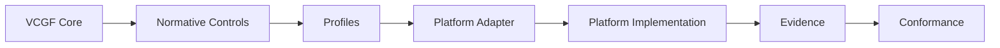

<!--
VCGF — Vibe Coding Governance Framework
SPDX-FileCopyrightText: 2026 Eng. Hamada Sami
SPDX-License-Identifier: Apache-2.0
Founder & Maintainer: Eng. Hamada Sami
Email: i@hamada.io
GitHub: https://github.com/Vibe-Coding-Commons
-->

# VCGF — Vibe Coding Governance Framework

[English → README.md](README.md)

**الإصدار:** 1.0.0 · **القناة:** Stable · **الترخيص:** Apache-2.0

VCGF إطار مفتوح ومحايد تجاه المنصات، قائم على الأدلة، يجمع الحوكمة والأمن والخصوصية والهندسة لتطوير البرمجيات بمساعدة الذكاء الاصطناعي بشكل منضبط وقابل للتدقيق وجاهز للإنتاج.

```mermaid
flowchart LR
  U[Understand] --> I[Inspect] --> IA[Impact Analysis] --> R[Risk Analysis] --> P[Plan] --> H[Human Approval] --> M[Implement] --> V[Validate] --> T[Test] --> S[Security Review] --> RR[Regression Review] --> RL[Release Review] --> RE[Release] --> MO[Monitor]
```

## 1. تموضع المشروع

VCGF هو **Open Governance Framework** و**Open Specification** مستقل عن أي Vendor لتنظيم التطوير البرمجي بمساعدة الذكاء الاصطناعي مع الأمن والخصوصية والتدقيق والأدلة.

## 2. لماذا وُجد VCGF

أدوات AI Coding تسرّع التنفيذ، لكنها قد تضخّم الانحراف المعماري والافتراضات الصامتة وتغييرات الـSchema غير الآمنة وضعف الصلاحيات وهلوسة الحزم. VCGF يضع عقدًا هندسيًا متكررًا حول هذه المخاطر.

## 3. المشكلة التي يعالجها

النمط غير المنضبط هو `Prompt → Implementation`. يستبدله VCGF بالفهم والفحص وتحليل الأثر والمخاطر والموافقة للتغييرات الحساسة والاختبار والأدلة ومراجعة الإصدار.

## 4. المبادئ الأساسية

Inspect before generation، Single Source of Truth، Minimum Safe Change، Deny by Default، Validation في Trusted Layer، حماية الأسرار، تقليل البيانات الشخصية، وعدم إضعاف الأمان لإصلاح وظيفة.

## 5. القانون المعماري

`Core → Normative Controls → Profiles → Platform Adapter → Platform-Specific Implementation`. الـCore يحدد WHAT والـAdapter يحدد HOW دون نسخ السياسة.

## 6. معمارية الإطار

الـCore المنطقي يتكون من `spec/` و`controls/` و`profiles/` و`schemas/`. أما المنصات ففي `platforms/`، والأتمتة في `scripts/` و`.github/workflows/`.

## 7. دورة التطوير

`Understand → Inspect → Impact Analysis → Risk Analysis → Plan → Human Approval When Required → Implement → Validate → Test → Security Review → Regression Review → Release Review → Release → Monitor`.

## 8. نموذج الـControl

كل Control له ID ثابت، Requirement Level، غرض، مخاطر، مبرر، نطاق، Guidance محايد، طريقة تحقق، Evidence، Exceptions، Dependencies، Related Controls، References، وChange History.

## 9. مجالات الـControls

الإصدار 1.0.0 يغطي 17 مجالًا: Governance وAI Governance وArchitecture وSecurity وIdentity & Access وData Protection وPrivacy وDatabase وAPI وSecrets وDependencies وFile Handling وLogging/Auditing وTesting وRelease وOperations وIncident Response.

## 10. اللغة المعيارية

تُستخدم MUST وMUST NOT وSHOULD وSHOULD NOT وMAY استخدامًا معياريًا. التفاصيل في [normative language](spec/normative-language.md).

## 11. تصنيف المخاطر

التغييرات LOW أو MEDIUM أو HIGH أو CRITICAL حسب الأثر والصلاحيات وحساسية البيانات وإمكانية الرجوع والتعرض للإنتاج وعدم اليقين.

## 12. بوابات الموافقة البشرية

الموافقة البشرية إلزامية في التغييرات الحساسة مثل Authentication وAuthorization وDestructive Database Changes وProduction Secrets/Config وInfrastructure وPII وPayments وSecurity Controls وMajor Architecture.

## 13. Profiles

يوجد Baseline وProduction وHigh-Assurance. القائمة المعيارية للـControls داخل `profile.yaml` وليست README.

## 14. Platform Adapters

كل Adapter حزمة مستقلة بإصدار ونطاق وتوافق وقدرات وحدود وControl Mapping ومصادر تحقق.

## 15. المنصات المدعومة

يدعم v1.0.0: Generic وLovable وClaude Code وBolt وv0 وReplit وCursor.

## 16. نموذج الـAdapter

الـAdapter يشير إلى Controls ولا يعيد تعريفها. إذا لم توجد Native Enforcement موثقة يبقى التنفيذ EXTERNAL أو PARTIAL أو PROMPT-ENFORCED.

## 17. إصدارات الـAdapters

Framework SemVer مستقل عن Adapter SemVer، ويمكن تحديث Adapter دون تغيير Core عندما لا يتغير العقد المعياري.

## 18. التحقق من خصائص المنصات

كل Claim مهم للمنصة يُسجل في `verification/sources.yaml` مع المصدر والتاريخ. الأولوية للمصادر الرسمية.

## 19. سياسة منع الهلوسة

لا يتم اختراع API أو Rule File أو Permission Model أو Secret Store أو Native Capability. غير المتحقق منه يوصف `UNVERIFIED`.

## 20. حالات Control Mapping

الحالات: NATIVE وCONFIGURABLE وPROMPT-ENFORCED وEXTERNAL وPARTIAL وUNSUPPORTED وNOT-APPLICABLE وUNVERIFIED.

## 21. نموذج الأدلة Evidence

الأدلة قد تشمل Tests وCI وCode Review وConfig وAudit Logs وThreat Model وSBOM وSecurity Scan وDeployment Evidence وChecksums/Signatures.

## 22. إدارة الاستثناءات

الاستثناء يحتاج Control ID وReason وRisk وOwner وCompensating Control وApproval وتواريخ إنشاء/انتهاء/مراجعة وStatus.

## 23. Conformance

نسخ ملفات VCGF لا يعني Conformance. يلزم Version وProfile وAdapter/Version وEvidence وExceptions وFindings وUnsupported/External Controls وتاريخ تحقق.

## 24. التغطية الأمنية

يشمل Authentication/Authorization/RBAC/ABAC/Object Authorization/Tenant Isolation/Sessions/MFA/Passwords/Recovery/Validation/Injection/XSS/CSRF/SSRF/CORS/APIs/Files/Encryption/Secrets/Logging/Backups/Monitoring/Incident Response.

## 25. حوكمة الذكاء الاصطناعي

يشمل Context/Prompt Governance، Architecture Drift، Silent Assumptions، Unauthorized Refactoring، Hallucinated APIs/Packages، Tool Injection، تغييرات Schema/Auth/Business Logic، حذف الاختبارات، إضعاف Security Controls، وHuman Approval.

## 26. الخصوصية

يشمل Data Classification وMinimization وPII Protection وField-Level Encryption عند الحاجة وLog Redaction وRetention وSecure Deletion وExports/Backups وحوادث البيانات الشخصية.

## 27. أمن سلسلة التوريد

يشمل Dependency Provenance وLockfiles وVulnerability Review ومخاطر AI-generated packages وSBOM/Dependency Inventory.

## 28. حوكمة الإصدار

يتضمن Definition of Done وSecurity Gate وRollback Readiness وMonitoring وRelease Artifact Integrity/Provenance.

## 29. البدء السريع

اختر Profile ثم Adapter، ثبّت تعليماته، أكمل قوالب المشروع، نفذ Controls، اجمع Evidence، اختبر وراجع قبل Conformance.

## 30. مسار التبني

راجع [دليل التبني](docs/adoption-guide.md) و[دليل التنفيذ](docs/implementation-guide.md).

## 31. اختيار Profile

Baseline للتجارب منخفضة المخاطر، Production للأنظمة الحقيقية، High-Assurance للأنظمة الحساسة والمؤسساتية وعالية الأثر.

## 32. اختيار Adapter

استخدم Adapter مخصصًا فقط لنطاقه الموثق. إذا لم يوجد استخدم Generic بدل افتراض خصائص منصة.

## 33. استخدام Generic Adapter

Generic هو Reference Adapter المحايد ويعتمد على قواعد محمولة وPrompts وExternal Runtime/CI Controls.

## 34. خريطة المستودع

راجع [REPOSITORY-TREE.md](REPOSITORY-TREE.md) و[FILE-MANIFEST.md](FILE-MANIFEST.md).

## 35. الملفات المهمة

ابدأ بـ`spec/VCGF-CORE.md` و`spec/control-catalog.yaml` والـProfile والـAdapter المختارين و`spec/conformance.md`.

## 36. القوالب Templates

توجد قوالب لسياق المشروع وSecurity Profile وRegulatory Overlay وImpact Analysis وDecision Record وThreat Model والصلاحيات والـValidation وتصنيف البيانات والتشفير والاستثناءات والهجرة والإصدار والاختبارات.

## 37. قوائم الفحص

تغطي Project Initiation وPre-Development وPre-Commit وSecurity Review وDatabase Change وPre-Release وProduction Release.

## 38. Playbooks

توجد إجراءات تشغيلية لـNew Project Bootstrap وExisting Project Hardening وKey Rotation وPassword Reset Testing.

## 39. أمثلة التبني

توجد أمثلة SaaS وCRM وERP وE-commerce وGeneric Web App توضّح Adoption ولا تدّعي أنها تطبيقات مكتملة.

## 40. التحقق الآلي

ثبت `requirements-dev.txt` ثم نفذ `python scripts/release-quality-gate.py` للتحقق من Controls وProfiles وAdapters وSchemas والروابط والحقوق والإصدارات والبنية.

## 41. GitHub Actions

توجد خمسة Workflows حقيقية للتحقق من Framework وAdapters وSchemas والروابط وRelease Quality Gate.

## 42. الملفات المولدة آليًا

`spec/control-catalog.yaml` و`REPOSITORY-TREE.md` و`FILE-MANIFEST.md` يتم توليدها/التحقق منها آليًا ولا تعدل يدويًا.

## 43. إنشاء Adapter جديد

انسخ `_adapter-template`، حدد Surface بدقة، سجل المصادر الرسمية، Map كل Controls، وثق القيود، أضف Rules/Prompts/Tests مفيدة، ثم نفذ Validators.

## 44. Versioning

يستخدم VCGF Semantic Versioning للـCore والـAdapters والـSchemas. Control IDs تصبح Immutable بعد v1.0.0.

## 45. حالة المشروع

VCGF Core v1.0.0 Stable. حالة كل Adapter مستقلة حسب جودة التحقق.

## 46. خارطة الطريق

راجع [ROADMAP.md](ROADMAP.md).

## 47. المساهمة

راجع [CONTRIBUTING.md](CONTRIBUTING.md). لا Control مكرر ولا Claim غير موثق كحقيقة.

## 48. الإبلاغ الأمني

مشكلات أمن Repository تُرسل بشكل خاص وفق [SECURITY.md](SECURITY.md).

## 49. الحوكمة

راجع [GOVERNANCE.md](GOVERNANCE.md) لدورة Controls وقبول/إهمال Adapters ومسؤوليات Maintainer والإصدارات والتوافق.

## 50. القيود

VCGF لا يضمن وحده أمان البرنامج. التعليمات السلوكية ليست Runtime Enforcement، والمنصات تتغير، والأدلة قد تكون ناقصة إذا لم تُطبق فعليًا.

## 51. إخلاء المسؤولية

VCGF ليس ISO Standard ولا Government/Accredited/Certified Standard، ولا يستبدل الالتزامات القانونية والتنظيمية أو الاختبارات المهنية.

## 52. الترخيص

الترخيص Apache License 2.0. حقوق المؤلف تبقى لأصحابها بينما صلاحيات الاستخدام يحددها الترخيص.

## 53. حقوق النشر

Copyright © 2026 Eng. Hamada Sami. راجع [COPYRIGHT.md](COPYRIGHT.md) و[NOTICE.md](NOTICE.md).

## 54. المؤسس والمشرف

المؤسس والمشرف: **Eng. Hamada Sami**.

## 55. بيانات التواصل

Mobile/WhatsApp: +966560000934 · Email: i@hamada.io · LinkedIn: https://www.linkedin.com/in/hamadas/ · GitHub: https://github.com/Vibe-Coding-Commons

## 56. Vibe Coding Commons

تتم صيانة VCGF ضمن منظمة Vibe Coding Commons: https://github.com/Vibe-Coding-Commons.

## 57. الاستشهاد Citation

ملف `CITATION.cff` يتيح الاستشهاد بالإصدار المحدد على GitHub.

## 58. شكر ومراجع

الإطار يستفيد من إرشادات أمنية عامة ووثائق رسمية للمنصات موثقة في [المصادر](docs/references/sources-and-standards.md) دون ادعاء Endorsement أو Certification.

## 59. تاريخ الانتقال

تطور VCGF من Lovable Secure Vibe Coding Governance Framework، وسجلات الهجرة محفوظة في `docs/project-history/v1.0.0/`.

## 60. سلامة حزمة الإصدار

حزمة GitHub-ready تُراجع قبل الضغط ويصدر معها SHA-256 للتحقق من سلامة الملف.

---

## توقيع المؤسس

**Founder & Maintainer:** Eng. Hamada Sami  
**Mobile / WhatsApp:** +966560000934  
**Email:** i@hamada.io  
**LinkedIn:** https://www.linkedin.com/in/hamadas/  
**GitHub:** https://github.com/Vibe-Coding-Commons  

Copyright © 2026 Eng. Hamada Sami.
