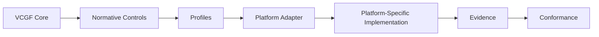
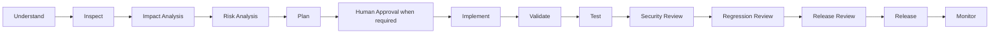

<!--
VCGF — Vibe Coding Governance Framework
SPDX-FileCopyrightText: 2026 Eng. Hamada Sami
SPDX-License-Identifier: Apache-2.0
Founder & Maintainer: Eng. Hamada Sami
Email: i@hamada.io
GitHub: https://github.com/Vibe-Coding-Commons
-->

# VCGF — Vibe Coding Governance Framework

[العربية → README.ar.md](README.ar.md)

**Version:** 1.0.0 · **Release channel:** Stable · **License:** Apache-2.0

VCGF is an open, vendor-neutral, evidence-driven governance, security, privacy, and engineering framework for controlled, auditable, production-ready AI-assisted software development.

## 1. Project positioning

VCGF is an **Open Governance Framework** and **Open Specification for Governed AI-Assisted Software Development**. It is vendor-neutral and designed to help teams control AI-assisted changes without pretending that prompts are security boundaries.

## 2. Why VCGF exists

AI coding tools can accelerate delivery, but they can also amplify architecture drift, hidden assumptions, unsafe schema changes, weak authorization, dependency hallucination, and unverified production changes. VCGF creates a repeatable engineering contract around those risks.

## 3. Problem statement

The unsafe pattern is `Prompt → Implementation`. VCGF replaces it with inspection, impact/risk analysis, approval for sensitive work, validation, evidence, and release governance.

## 4. Core principles

Inspect before generation; preserve the established system as a contract; make the minimum safe change; deny by default; validate at trusted layers; keep secrets out of clients; minimize personal data; collect evidence; never weaken security to make a feature work.

## 5. Architectural rule

The non-negotiable architecture is `Core → Normative Controls → Profiles → Platform Adapter → Platform-Specific Implementation`. Core controls define WHAT must be achieved. Adapters explain HOW a verified platform surface can help implement, guide, or evidence it.

## 6. Framework architecture

The logical Core is `spec/`, `controls/`, `profiles/`, and `schemas/`. `platforms/` contains adapters. `templates/`, `checklists/`, and `playbooks/` support adoption. `scripts/` and `.github/workflows/` make the repository machine-validatable.

## 7. Development lifecycle

VCGF uses `Understand → Inspect → Impact Analysis → Risk Analysis → Plan → Human Approval When Required → Implement → Validate → Test → Security Review → Regression Review → Release Review → Release → Monitor`.

## 8. VCGF Control Model

Each normative control has a stable ID, requirement level, purpose, risk, rationale, applicability, implementation-neutral guidance, verification method, evidence, exceptions, dependencies, related controls, references, platform considerations, and change history.

## 9. Control domains

VCGF v1.0.0 uses 17 domains: Governance, AI Governance, Architecture, Security, Identity & Access, Data Protection, Privacy, Database, API, Secrets, Dependencies, File Handling, Logging & Auditing, Testing, Release, Operations, and Incident Response.

## 10. Normative language

`MUST`, `MUST NOT`, `SHOULD`, `SHOULD NOT`, and `MAY` are used deliberately. See [normative language](spec/normative-language.md).

## 11. Risk classification

Changes are LOW, MEDIUM, HIGH, or CRITICAL based on blast radius, privilege, data sensitivity, irreversibility, financial impact, production exposure, and uncertainty. Authentication, authorization, production secrets, destructive migration, data deletion, and security-control changes are never treated as trivial.

## 12. Human approval gates

Human approval is required for sensitive authentication/authorization changes, destructive database work, production configuration, secrets, infrastructure, personal-data processing, payments, dependency replacement, major architecture changes, and security-control weakening.

## 13. Profiles

VCGF ships Baseline, Production, and High-Assurance profiles. `profile.yaml` is the canonical control set; the profile README explains intent. Select one based on actual risk, not convenience.

## 14. Platform adapters

Adapters are independent packages under `platforms/`. Each declares platform surface, version, compatibility, status, verified capabilities, limitations, control mapping, and source evidence.

## 15. Supported platforms

v1.0.0 includes Generic, Lovable, Claude Code, Bolt, v0, Replit, and Cursor adapters. A future platform can be added without modifying Core when its adapter can be verified.

## 16. Adapter model

Adapters MUST reference Core controls instead of copying them. Runtime controls remain EXTERNAL unless a documented platform capability materially enforces the requirement.

## 17. Adapter versioning

Framework SemVer and Adapter SemVer are independent. A Lovable or Cursor adapter can change without forcing a VCGF Core release when the Core contract is unchanged.

## 18. Platform verification model

Every material platform claim is recorded in `platforms/<adapter>/verification/sources.yaml` with verification date and source. Official documentation is preferred; unverifiable claims remain `UNVERIFIED`.

## 19. Zero-hallucination policy

VCGF adapters do not invent APIs, prompt files, permission models, secret stores, deployment behavior, or native security capabilities. Unknown capability is safer as `UNVERIFIED` than as an attractive fiction.

## 20. Control mapping statuses

Allowed mapping states are `NATIVE`, `CONFIGURABLE`, `PROMPT-ENFORCED`, `EXTERNAL`, `PARTIAL`, `UNSUPPORTED`, `NOT-APPLICABLE`, and `UNVERIFIED`.

## 21. Evidence model

Evidence may include automated/security tests, CI results, code review, configuration, audit logs, threat models, SBOM/provenance, scans, deployment records, checksums, signatures, and justified manual verification. See [evidence model](spec/evidence-model.md).

## 22. Exception management

A control exception needs reason, risk, owner, compensating control, approval, created/expiration/review dates, and status. Exceptions cannot be silent or permanent by accident.

## 23. Conformance

Copying VCGF files does not make a project conformant. Conformance requires version, profile, adapter/version, evidence for required controls, valid exceptions, unsupported/external-control records, findings, and validation date.

## 24. Security coverage

The controls cover authentication, authorization/RBAC/ABAC/object-level access, tenant isolation, sessions/MFA, passwords/recovery, enumeration/brute force, validation/output encoding, SQL/command/template injection, XSS/CSRF/SSRF/CORS/webhooks, APIs, rate limiting, files, database integrity, encryption/key management, secrets, errors, backups, monitoring, and incident response.

## 25. AI governance coverage

The controls address context governance, persistent instructions, prompt governance, inspect-before-generate, architecture drift, silent assumptions, unauthorized refactoring, unrequested features, hallucinated APIs/packages, tool/prompt injection, schema/auth/business-logic changes, test deletion, security-control weakening, destructive operations, and human approval.

## 26. Privacy coverage

VCGF covers data classification, minimization and purpose limitation, PII protection, field-level encryption when justified, logging redaction, retention, secure deletion, export/backup protection, and personal-data incident handling.

## 27. Supply-chain security

Dependency controls cover provenance, locked/reproducible dependencies, vulnerability review, AI-generated package risk, and SBOM/dependency inventory for Production and High-Assurance adoption.

## 28. Release governance

Definition of Done, security gate, rollback readiness, monitoring, and release artifact integrity/provenance prevent a successful build from being mistaken for a safe release.

## 29. Quick start

Choose a profile, choose an adapter, install adapter instructions, complete project context/security artifacts, implement required controls, collect evidence, run reviews/tests, and only then record conformance.

## 30. Adoption workflow

See [adoption guide](docs/adoption-guide.md) for the end-to-end project workflow and [implementation guide](docs/implementation-guide.md) for technology-neutral implementation guidance.

## 31. How to select a profile

Use Baseline for low-risk prototypes, Production for real users/business data/internet-facing systems, and High-Assurance for sensitive institutional, regulated, or high-impact systems.

## 32. How to select an adapter

Use a dedicated adapter only for the exact documented platform surface. If the platform or surface is not supported, use Generic instead of forcing a misleading mapping.

## 33. Generic Adapter usage

The Generic Adapter is the reference fallback. It supplies portable rules/prompts and maps runtime security to external code/CI/infrastructure controls without assuming vendor features.

## 34. Repository map

Use [REPOSITORY-TREE.md](REPOSITORY-TREE.md) for the generated full tree and [FILE-MANIFEST.md](FILE-MANIFEST.md) for purpose/category/source status of every release file.

## 35. Important files

Start with `spec/VCGF-CORE.md`, `spec/control-catalog.yaml`, the selected profile, the selected adapter, and `spec/conformance.md`. Governance and security reporting live in `GOVERNANCE.md` and `SECURITY.md`.

## 36. Templates

Reusable project context, security profile, regulatory overlay, change impact, decision record, threat model, roles, field validation, data classification, encryption register, exception, migration review, release evidence, and security-test evidence are under `templates/`.

## 37. Checklists

Operational checklists cover project initiation, pre-development, pre-commit, security review, database change, pre-release, and production release.

## 38. Playbooks

Operational execution procedures under `playbooks/` cover new-project bootstrap, existing-project hardening, key rotation, and password-reset security testing.

## 39. Examples

`examples/` contains SaaS, CRM, ERP, e-commerce, and generic web-app adoption examples. They demonstrate adoption choices rather than pretending to be complete applications.

## 40. Automated validation

Install `requirements-dev.txt` and run `python scripts/release-quality-gate.py`. Validators check control metadata, profiles, adapters, schemas, cross-references, links, attribution, forbidden release markers, version consistency, and repository structure.

## 41. GitHub Actions

Five real workflows under `.github/workflows/` validate framework structure, adapters, schemas, internal links, and the combined release quality gate on pushes and pull requests.

## 42. Generated artifacts

`spec/control-catalog.yaml`, `REPOSITORY-TREE.md`, and `FILE-MANIFEST.md` are generated/validated from repository source data and labeled `AUTO-GENERATED — DO NOT EDIT MANUALLY`.

## 43. How to create a new adapter

Copy `platforms/_adapter-template/`, define exact scope, register official-source claims, map every control, document limitations, add useful rules/prompts/tests, validate, and publish only with an honest status.

## 44. Versioning

VCGF uses Semantic Versioning for Core, adapters, and schemas. Control IDs are immutable after v1.0.0 and deprecated IDs are never reused.

## 45. Project status

VCGF Core v1.0.0 is Stable. Adapter status is independent and declared in each `adapter.yaml` based on its verified platform surface.

## 46. Roadmap

See [ROADMAP.md](ROADMAP.md). v1.x focuses on compatible evidence/tooling improvements; breaking schema/conformance changes are candidates for a future major version.

## 47. Contribution

See [CONTRIBUTING.md](CONTRIBUTING.md). New controls must avoid overlap; adapters require source verification; all contributions must pass automation and preserve attribution.

## 48. Security reporting

Repository security concerns should be reported privately according to [SECURITY.md](SECURITY.md), not through a public vulnerability issue.

## 49. Governance

See [GOVERNANCE.md](GOVERNANCE.md) for control lifecycle, ID immutability, adapter acceptance/deprecation, maintainer responsibilities, release process, and backward compatibility.

## 50. Limitations

VCGF cannot guarantee secure software by itself. AI instructions can be ignored, platform behavior can change, and evidence can be incomplete. VCGF improves governance only when teams implement and verify controls at real trust boundaries.

## 51. Disclaimer

VCGF is not an ISO, government, accredited, or certified international standard. It does not replace legal, regulatory, security-testing, or professional engineering obligations applicable to a project.

## 52. License

VCGF is licensed under Apache License 2.0. Copyright ownership remains with the respective authors while reuse permissions are governed by the license.

## 53. Copyright

Copyright © 2026 Eng. Hamada Sami. See [COPYRIGHT.md](COPYRIGHT.md) and [NOTICE.md](NOTICE.md).

## 54. Founder & Maintainer

**Eng. Hamada Sami** founded and maintains VCGF under Vibe Coding Commons.

## 55. Contact information

Mobile / WhatsApp: +966560000934 · Email: i@hamada.io · LinkedIn: https://www.linkedin.com/in/hamadas/ · GitHub: https://github.com/Vibe-Coding-Commons

## 56. Vibe Coding Commons

VCGF is maintained in the Vibe Coding Commons organization: https://github.com/Vibe-Coding-Commons.

## 57. Citation

GitHub citation metadata is provided in `CITATION.cff`; cite the exact VCGF version used in a project or publication.

## 58. Acknowledgements

VCGF is informed by public security guidance and official platform documentation listed in [sources and standards](docs/references/sources-and-standards.md). References do not imply endorsement or certification.

## 59. Migration history

VCGF evolved from the earlier Lovable Secure Vibe Coding Governance Framework. v1 migration records are retained under `docs/project-history/v1.0.0/`.

## 60. Release integrity

The GitHub-ready release is validated before packaging, and a SHA-256 checksum is published alongside the ZIP so recipients can verify package integrity.

---

## Founder signature

**Founder & Maintainer:** Eng. Hamada Sami  
**Mobile / WhatsApp:** +966560000934  
**Email:** i@hamada.io  
**LinkedIn:** https://www.linkedin.com/in/hamadas/  
**GitHub:** https://github.com/Vibe-Coding-Commons  

Copyright © 2026 Eng. Hamada Sami.
