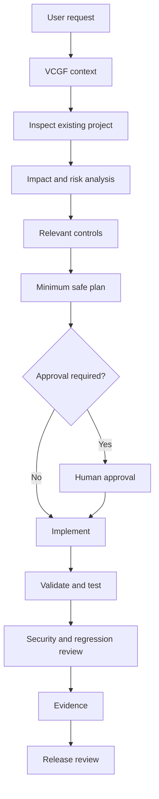
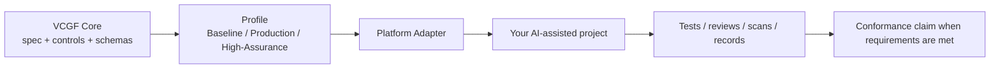

<!--
VCGF — Vibe Coding Governance Framework
SPDX-FileCopyrightText: 2026 Eng. Hamada Sami
SPDX-License-Identifier: Apache-2.0
Founder & Maintainer: Eng. Hamada Sami
Email: i@hamada.io
GitHub: https://github.com/Vibe-Coding-Commons
-->

# VCGF — Vibe Coding Governance Framework

[العربية → README.ar.md](README.ar.md)

  

**Build faster with AI — without giving up control of security, architecture, data, and release quality.**

VCGF is an open, vendor-neutral governance, security, privacy, and engineering framework for AI-assisted software development. It gives AI coding tools a controlled way to understand a project, assess impact, apply security rules, stop for human approval when needed, test changes, and leave evidence before a change is considered complete.

> **Start here:** [5-minute quick start](#5-minute-quick-start) · [Choose a platform](#supported-ai-coding-platforms) · [Install VCGF](#install-vcgf) · [Daily user guide](docs/user-guide.md) · [Technical specification](spec/VCGF-CORE.md)

## Current version and v1.1 development status

**Base version: v1.0.0. Target version: v1.1.0 — unreleased development checkpoint.** `VERSION` remains `1.0.0` until acceptance is complete. The new contracts explicitly use `contract_version: 1.1.0`. This checkout contains opt-in additions; it is not a completed or published v1.1 release. The original guide below describes the v1.0 foundation; use this section and the runtime guide for the new path.

### What is new, and what can you use it for?

| Addition | Practical use and result | Verification boundary |
|---|---|---|
| Task Router and typed dependency resolver | Route an inspected Login task to authentication, session and conditional recovery/email requirements; keep a color-only change focused on UX | Explicit reviewed intent; not a general natural-language classifier |
| Selective loading and budget control | Load the relevant controls, pack requirements and references once; block or split an oversized task rather than silently omit controls | Local file and graph checks; UTF-8 byte estimates, not observed model tokens |
| Context manifest and session handoff | Reuse known project context and refresh affected facts after source changes or expiry | Source hashes do not prove an interpretation is true |
| Seven versioned contracts | Validate capabilities, context, routes, approvals, evidence, preferences and adapter capabilities | Structural/local checks do not authenticate an approver or prove a test ran |
| Approval, evidence and scope gates | Reject changed/expired scope, missing artifacts and incomplete Profile coverage; show minimal/standard/audit evidence | Actual enforcement needs a trusted host identity/review adapter |
| Executable email reference | Exercise verified TLS SMTP, an encrypted outbox and Microsoft 365 OAuth2 integration code | Local TLS was tested; live Microsoft 365 delivery remains Unverified |
| Executable backup reference | Restore an encrypted SQLite backup with matching database rows and attachments; reject tampering and missing files | SQLite/private local storage tested; PostgreSQL/MySQL restore integration remains Unverified |
| Generated adapter entries and ChatGPT Skill source | Adopt one compact entry per platform and inspect a repository Skill that progressively loads policy | Eight candidate adapters; local equivalence and one synthetic Skill exercise do not verify live platform behavior |
| Reference CLI and measurements | Inspect selected controls with route/controls/explain, create a handoff and inspect evidence decisions | 36 local context measurements; full platform/model and AR/EN acceptance remains open |

The **23 capability definitions** retain requirements from original sections **14–39**. Requirement documents are not proof that each capability has been implemented in an application. No existing Control ID, Profile membership, license or founder attribution is changed by this development work. The current documentation update changes the two READMEs and changelog explicitly; the earlier statement that all 383 original files were unchanged describes the preceding checkpoint.

### Try the opt-in runtime

From the project root, with Python 3.12 and `requirements-dev.txt` installed:

```bash
python scripts/vcgf.py --help
python scripts/vcgf.py controls
python scripts/vcgf.py explain VCGF-IAM-005
python scripts/vcgf.py route examples/runtime/login/task.json examples/runtime/login/context.json --project-root examples/runtime/login --dry-run
```

The Login example is synthetic. Its context has an expiry: a stale/changed fact must block and be refreshed from a new inspection, not bypassed merely to obtain a passing result. `ready_to_plan` is permission to proceed to planning, not authorization to change production or deploy. For styling, use the explicit `button-color` intent after inspection; do not classify every mention of Login as an authentication change.

### Evidence and remaining work

The preceding development checkpoint recorded **178 passing local tests**, **14 passing legacy validators**, and **36 local context measurements**. Results are tied to their recorded files, environment and scope. Those counts do not mean the whole v1.1 release passed; new documentation validation is recorded separately.

Still open: full pack acceptance, live Microsoft 365 OAuth delivery, PostgreSQL/MySQL restore and attachment consistency, trusted host enforcement, live verification of all eight platform surfaces, detailed remaining mappings, and platform/model token benchmarks. None is silently deferred. Discovery/Readiness remains separately planned and requires its own approved scope.

Read [the runtime guide](docs/runtime-guide.md), [reference integrations](examples/integrations/README.md), [the development report](docs/project-history/v1.1.0/CONTINUATION_REPORT_AR.md), [recorded test evidence](docs/project-history/v1.1.0/continuation-test-evidence.json), [open items](docs/project-history/v1.1.0/open-items.json), and [the changelog](CHANGELOG.md). Platform opt-in instructions are in each adapter's `RUNTIME-INSTALLATION.md`; ChatGPT's repository Skill source is at `platforms/chatgpt/skills/vcgf/SKILL.md`.

## Table of contents

- [What is VCGF?](#what-is-vcgf)
- [Why does VCGF exist?](#why-does-vcgf-exist)
- [What changes when you use VCGF?](#what-changes-when-you-use-vcgf)
- [VCGF objectives](#vcgf-objectives)
- [5-minute quick start](#5-minute-quick-start)
- [Supported AI coding platforms](#supported-ai-coding-platforms)
- [Install VCGF](#install-vcgf)
- [Choose a profile](#choose-a-profile)
- [What does VCGF include?](#what-does-vcgf-include)
- [Capabilities: without vs with VCGF](#capabilities-without-vs-with-vcgf)
- [Practical examples](#practical-examples)
- [Before VCGF vs with VCGF](#before-vcgf-vs-with-vcgf)
- [How VCGF works](#how-vcgf-works)
- [How do I know VCGF is active?](#how-do-i-know-vcgf-is-active)
- [Do I need to be a programmer?](#do-i-need-to-be-a-programmer)
- [What VCGF does not do](#what-vcgf-does-not-do)
- [What results should you expect?](#what-results-should-you-expect)
- [Technical depth](#technical-depth)
- [Repository map](#repository-map)
- [Automated validation](#automated-validation)
- [Governance, contribution, and security reporting](#governance-contribution-and-security-reporting)
- [License and founder](#license-and-founder)

# What is VCGF?

In simple terms, **VCGF is a rulebook and workflow for using AI coding tools safely and predictably on real software projects.**

It is not an AI model, coding tool, IDE, security scanner, or replacement for developers. You add VCGF to the way you use tools such as Lovable, Claude Code, Bolt, v0, Replit, Cursor, or another AI coding environment.

VCGF combines three things:

- **Governance** — the AI should understand the project, explain impact, stay inside scope, and stop for approval on sensitive work.
- **Security & privacy** — changes must respect authentication, authorization, validation, data protection, secrets, database integrity, file security, APIs, and other controls.
- **Engineering discipline** — changes should be testable, traceable, reviewable, reversible where appropriate, and supported by evidence.

A **Control** is simply a VCGF rule that defines something the project must do or must avoid. An **Adapter** translates VCGF's platform-neutral rules into a way that fits a specific AI coding platform. A **Profile** selects how much of VCGF is required for your project's risk level.

# Why does VCGF exist?

AI coding tools are fast, but speed can hide risk. A short request may cause changes far beyond what the user realizes.

### Example: “Add Reset Password”

Without a governance framework, an AI might create a reset endpoint and screen but miss account-enumeration resistance, token expiry, single-use tokens, rate limiting, secure token storage, old-session invalidation, or recovery/MFA interactions.

With VCGF, the AI is expected to inspect the current authentication system first, identify affected files and trust boundaries, apply the password-recovery and validation controls, plan tests, and stop for approval when the change crosses a sensitive security boundary.

### Example: “Add an admin role”

A UI-only implementation could hide a button while leaving the API or database accessible. VCGF requires the AI to inspect the existing authorization model and verify enforcement on trusted server/database layers, including allowed **and denied** paths.

### Example: “Let customers upload files”

A quick implementation may accept any extension, trust MIME type, create a public bucket, or expose other users' files. VCGF brings file validation, private access, authorization, safe naming, size/type limits, content risk, and download permissions into the plan.

The goal is not to make AI slow. The goal is to make important changes **controlled instead of accidental**.

# What changes when you use VCGF?

Without VCGF, a common pattern is: you describe the feature, the AI starts editing, and you discover architecture/security side effects afterward.

With VCGF, a sensitive change should look more like this:

1. The AI reads the project rules and context.
2. It inspects the existing implementation.
3. It identifies impacted code, database, APIs, roles, files, integrations, and tests.
4. It classifies risk and selects relevant controls.
5. It shows a minimum-safe-change plan.
6. It pauses for human approval when the change is sensitive.
7. It implements only the approved scope.
8. It validates and tests both successful and denied/failure paths where relevant.
9. It performs security/regression review.
10. It records evidence and remaining findings before release.



# VCGF objectives

| Objective | What it means | Why it matters | Expected result |
|---|---|---|---|
| Security | Sensitive changes follow explicit controls instead of convenient shortcuts. | AI can accidentally weaken a trust boundary while fixing functionality. | Safer auth, API, database, file, secret, and deployment changes. |
| Governance | The AI explains impact/risk and respects approval gates. | Users need control over high-blast-radius changes. | Fewer surprise changes and clearer decisions. |
| Predictability | Persistent project rules and context reduce silent assumptions. | The same request should not produce a completely different architecture each time. | More consistent implementation. |
| Architecture protection | Existing architecture is treated as a contract unless a change is approved. | AI refactors can create drift and duplicate patterns. | Less uncontrolled redesign. |
| Data protection | Personal/sensitive data is minimized, classified, protected, retained, and deleted deliberately. | Data exposure often starts with small field/storage decisions. | Better privacy and encryption decisions. |
| Safe AI changes | The AI inspects before generation and avoids hallucinated APIs/packages. | Generated code can reference non-existent or risky dependencies. | More grounded code and supply-chain discipline. |
| Quality | Validation and tests are part of “done.” | A successful preview is not proof of correctness. | Better regression protection. |
| Traceability | Important decisions connect to controls and evidence. | Teams need to know why a change was made and how it was verified. | Easier review and audit. |
| Human control | High-risk work stops for approval. | Some decisions must remain explicitly human. | Better control of auth, data, production, payments, and infrastructure. |
| Production readiness | Release, monitoring, backup/recovery, and incident controls are included. | Secure coding alone is not enough for production. | More disciplined releases and operations. |

# 5-minute quick start

1. **Download VCGF** from the repository or release ZIP.
2. **Choose your platform** in [`docs/platform-guides/`](docs/platform-guides/README.md).
3. **Choose a profile**: Baseline, Production, or High-Assurance.
4. **Complete project context** using [`templates/project-context/project-context.md`](templates/project-context/project-context.md).
5. **Install the platform rule/instruction** exactly as described by the platform guide.
6. **Start a fresh AI session** and send the guide's first-session message.
7. **Verify VCGF is active** by asking the AI to identify version, profile, adapter, context, controls, and approval gates.
8. **Request your first change** and confirm the AI inspects/plans before sensitive implementation.

For daily use after setup, see [`docs/user-guide.md`](docs/user-guide.md).

# Supported AI coding platforms

| Platform | Adapter | Status | Who is it for? | Guide |
|---|---|---|---|---|
| Generic | `generic` 1.0.0 | stable | Any AI coding tool without a dedicated VCGF adapter | [Setup guide](docs/platform-guides/generic.md) |
| Lovable | `lovable` 1.0.0 | stable | Lovable builders using Workspace/Project Knowledge and repository context | [Setup guide](docs/platform-guides/lovable.md) |
| Claude Code | `claude` 1.0.0 | stable | Developers using Claude Code in a local or repository-based workflow | [Setup guide](docs/platform-guides/claude.md) |
| Bolt | `bolt` 1.0.0 | stable | Bolt users who want persistent project guidance through Project Knowledge | [Setup guide](docs/platform-guides/bolt.md) |
| v0 | `v0` 1.0.0 | stable | v0 users working with reusable Instructions, Plan Mode, Projects, and optional GitHub review | [Setup guide](docs/platform-guides/v0.md) |
| Replit | `replit` 1.0.0 | stable | Replit Agent users working inside a Replit project | [Setup guide](docs/platform-guides/replit.md) |
| Cursor | `cursor` 1.0.0 | stable | Cursor Agent / IDE users who want version-controlled project rules | [Setup guide](docs/platform-guides/cursor.md) |

Adapter status is read from each canonical `adapter.yaml`. A stable framework does not automatically make every future adapter stable.

# Install VCGF

## Beginner setup — no Git required

1. Download the VCGF release ZIP from GitHub.
2. Extract it on your computer.
3. Open `docs/platform-guides/README.md`.
4. Choose your platform.
5. Open `profiles/` and select the right risk profile.
6. Complete the project-context template.
7. Copy/paste/upload only the files listed by your platform guide.
8. Start a new AI session and run the activation check.

You do **not** need to copy all 84 control files into every AI chat.

## Developer setup — Git

```bash
git clone https://github.com/Vibe-Coding-Commons/VCGF.git
cd VCGF
python -m pip install -r requirements-dev.txt
python scripts/release-quality-gate.py
```

Then follow the [platform setup guide](docs/platform-guides/README.md). Git is useful for versioning and CI, but it is not required for the basic VCGF workflow.

# Choose a profile

| Profile | Choose it when... | v1.0.0 control expectation |
|---|---|---:|
| **Baseline** | Prototype, experiment, internal PoC, or other low-risk use. | 25 required controls |
| **Production** | Real users, employees, customers, business data, internet exposure, or planned production use. | 77 required controls |
| **High-Assurance** | Sensitive institutional, regulated, or high-impact system. | All 84 controls |

Profiles are not marketing tiers. They change the required controls and evidence. The canonical requirements are in each `profiles/<profile>/profile.yaml`.

# Key terms

- **Control** — a rule inside VCGF that defines something a project must, must not, should, or may do.
- **Adapter** — the part that translates VCGF's general rules into a setup that fits a specific AI coding platform.
- **Profile** — a selected set of required controls based on project risk.
- **Evidence** — proof that a control or change was actually reviewed/tested, such as a test result, CI result, review, scan, configuration record, or threat model.
- **Conformance** — a claim that a project applied the required controls for a specific VCGF version/profile/adapter and has evidence and documented exceptions.
- **Exception** — an approved, time-bounded reason a required control cannot be met, with risk owner and compensating controls.
- **Normative** — a requirement-bearing statement that uses terms such as MUST, MUST NOT, SHOULD, SHOULD NOT, or MAY.

See the full [`docs/terminology.md`](docs/terminology.md).

# What does VCGF include?

The following capabilities are present in the current VCGF repository. The README explains outcomes; the canonical requirements live in `controls/`.

## 1. AI governance and safe-change control

**What it does**  
Requires inspect-before-generation, no silent assumptions, impact analysis, minimum safe change, architecture-drift prevention, protection against unauthorized refactoring/unrequested features, persistent-context governance, hallucinated API/package prevention, human approval gates, and resistance to prompt/tool injection or attempts to weaken security controls.

**Why it matters**  
AI can confidently make broad changes based on incomplete context. Governance makes uncertainty visible and keeps scope intentional.

**Example**  
You ask for a new report. The AI finds an existing reporting service and reuses it instead of creating a second data-access pattern.

**Expected result**  
Fewer architecture surprises, fewer invented dependencies, and a clearer plan before risky edits.

## 2. Authentication, authorization, RBAC/ABAC, sessions, and MFA

**What it does**  
Covers authentication baseline, brute-force/enumeration resistance, password storage, secure recovery, MFA/session security, privileged access, object-level authorization, RBAC/ABAC, tenant isolation, and trusted-layer enforcement.

**Why it matters**  
Hiding UI controls is not authorization. Identity and permission mistakes can expose other users' data or privileged actions.

**Example**  
For an admin role, VCGF expects API/server/database enforcement and negative tests for non-admin users.

**Expected result**  
More consistent access-control decisions and stronger protection against privilege/data-isolation failures.

## 3. Input validation, field validation, encoding, and injection protection

**What it does**  
Requires critical-field validation at trusted layers, output encoding/sanitization, and defenses for SQL/NoSQL-style query injection, command injection, template injection, XSS, path/header/formula injection, and related untrusted-input risks.

**Why it matters**  
Frontend validation can be bypassed and AI-generated code may build unsafe dynamic queries or rendering paths.

**Example**  
Adding a national ID or amount field triggers type/format/range/business validation and server-side enforcement, not only a browser regex.

**Expected result**  
Less invalid/malicious input reaches business logic, databases, templates, or operating-system boundaries.

## 4. API, CSRF/SSRF/CORS, rate limiting, and webhook/integration security

**What it does**  
Covers server functions/APIs, business-logic integrity, rate limiting/abuse prevention, SSRF/CSRF/CORS, webhook verification, and third-party integration security.

**Why it matters**  
An endpoint is independently callable even if the normal UI hides it.

**Example**  
A webhook handler verifies authenticity and replay/authorization assumptions rather than trusting any request that reaches the URL.

**Expected result**  
APIs are treated as security boundaries, not as hidden implementation details.

## 5. File upload and private-file access

**What it does**  
Requires validation of file type/size/name/content assumptions, private-by-default access where appropriate, authorization, safe storage paths, and secure download/access behavior.

**Why it matters**  
File features can become upload abuse, malware/content risk, path issues, or cross-user data exposure.

**Example**  
Customer attachments are stored privately and retrieved only after server-side authorization instead of being placed in an unrestricted public bucket.

**Expected result**  
Safer file lifecycle and less accidental exposure.

## 6. Database governance, integrity, transactions, concurrency, and secure queries

**What it does**  
Covers schema-change governance, constraints/integrity, migration safety, transaction boundaries, concurrency/race conditions, RLS/data-layer security where applicable, and parameterized/safe query patterns.

**Why it matters**  
A “small” schema change can corrupt existing data or weaken tenant isolation.

**Example**  
Before adding a required column, the AI checks existing rows, migration/rollback strategy, constraints, indexes, and dependent code.

**Expected result**  
More compatible migrations and fewer data-integrity surprises.

## 7. Encryption, key management, personal data, privacy, retention, and secure deletion

**What it does**  
Covers data classification, minimization/purpose limitation, personal-data protection, field-level encryption where the threat model requires it, key management/rotation, logging redaction, retention, secure deletion, backups/exports, and personal-data incident handling.

**Why it matters**  
Collecting a sensitive field changes privacy, breach impact, access, retention, and recovery requirements.

**Example**  
A sensitive identifier is classified first; if field-level encryption is required, keys are managed separately and search/index needs are designed deliberately rather than storing plaintext for convenience.

**Expected result**  
Better control of why sensitive data exists, who can access it, how it is protected, and when it disappears.

## 8. Secrets, environment protection, and secure configuration

**What it does**  
Requires secrets to stay out of browser code, prompts, repositories, logs, URLs, and other unsafe locations; includes environment separation and production protection.

**Why it matters**  
AI coding sessions can accidentally paste or hard-code credentials while solving integration problems.

**Example**  
A third-party API key is placed in an approved server/project secret facility and only used from a trusted server-side path.

**Expected result**  
Lower risk of credential leakage and environment confusion.

## 9. Dependency security, supply chain, provenance, and SBOM

**What it does**  
Covers dependency necessity, provenance, version/lockfile discipline, vulnerability review, AI-hallucinated package risk, supply-chain integrity, and SBOM/dependency inventory expectations.

**Why it matters**  
Generated code may confidently install a typo-squatted, abandoned, or unnecessary package.

**Example**  
Before adding a package, the AI verifies that it exists, is the intended package, is necessary, and fits the project's supply-chain policy.

**Expected result**  
Fewer unnecessary or unverified dependencies and better dependency traceability.

## 10. Audit logging, tamper resistance, secure errors, and monitoring

**What it does**  
Covers security/audit logging, privacy redaction, tamper resistance where required, safe error messages, security monitoring, and alerting.

**Why it matters**  
Without useful evidence and monitoring, teams may not know that a control failed or an incident is underway.

**Example**  
A privileged action records actor/action/resource/time/result without logging tokens, passwords, or unnecessary PII.

**Expected result**  
Better investigation and detection without turning logs into a new data leak.

## 11. Security testing, regression testing, release security, rollback, backup/recovery, and incident response

**What it does**  
Covers security tests, negative tests, regression tests, definition of done, pre-release gates, rollback readiness, artifact integrity/provenance, backup/recovery, monitoring, and incident-response minimums.

**Why it matters**  
“Works in preview” is not a production release criterion.

**Example**  
An authorization bug fix includes a regression test proving User B still cannot access User A's record and release evidence showing the test passed.

**Expected result**  
Changes are easier to review, release, roll back, and investigate.

## 12. Evidence, exceptions, conformance, profiles, adapters, and automated validation

**What it does**  
Defines how evidence is collected, how exceptions expire and are reviewed, what a VCGF conformance claim means, how profiles select controls, how adapters map platform capabilities, and how repository automation validates IDs, schemas, mappings, links, versions, attribution, and structure.

**Why it matters**  
Documentation alone does not prove a control exists in the application.

**Example**  
A Production conformance record identifies framework/profile/adapter versions, required controls, evidence, approved exceptions, unsupported/external controls, and outstanding findings.

**Expected result**  
A framework that is evidence-driven and machine-validatable instead of a collection of prompts.


## Coverage map at a glance

The detailed sections above are grouped for readability. The current VCGF controls and supporting material explicitly cover these capabilities:

| Area | Included capabilities |
|---|---|
| AI governance | AI context management, prompt governance, persistent project context, inspect-before-generation, impact/risk analysis, human approval gates, minimum safe change, architecture drift prevention, silent-assumption prevention, unauthorized refactoring prevention, unrequested feature prevention, hallucinated API/dependency prevention, prompt injection resilience, tool injection resilience, security-control protection |
| Identity & access | Authentication, authorization, RBAC, ABAC, object-level authorization, tenant isolation, sessions, MFA, password security, secure password reset/recovery, brute-force resistance, enumeration resistance, privileged access |
| Input & browser-facing security | Input validation, critical field validation, output encoding/sanitization, injection protection, SQL/query injection, command injection, template injection, XSS, CSRF, SSRF, CORS |
| APIs & integrations | API/server-function security, business-logic integrity, rate limiting/abuse prevention, webhook security, third-party integration security |
| Files & storage | File upload security, type/size/name handling, private file access, authorization for download/access |
| Database | Database change governance, integrity constraints, secure queries, RLS/data-layer enforcement where applicable, transactions, concurrency/race handling, migration/rollback review |
| Data protection & privacy | Encryption, field-level encryption, key management/rotation, personal-data protection, privacy, data classification, minimization/purpose limitation, retention, secure deletion, backup/export protection, logging redaction |
| Secrets & environments | Secrets management, environment variables, environment separation, production protection, secure configuration and secret-exposure response |
| Dependencies & supply chain | Dependency governance, hallucinated package defense, supply-chain security, provenance, vulnerability review, lockfiles, SBOM/dependency inventory |
| Audit & operations | Audit logging, tamper resistance where applicable, secure error handling, security monitoring/alerting, configuration drift review, backup/recovery, incident response |
| Testing & release | Security testing, negative tests, regression testing, definition of done, release security gates, rollback readiness, release artifact integrity/provenance |
| Framework governance | Evidence management, exception management, conformance, profiles, platform adapters, machine-readable mappings/schemas, automated validation and GitHub CI |

# Capabilities: without vs with VCGF

| Capability | Without VCGF | With VCGF | Result |
|---|---|---|---|
| Authentication change | AI may focus on UI/provider setup only. | Existing auth/session/recovery/authorization impact is reviewed and approval may be required. | Safer identity changes. |
| Database migration | Schema may change before existing data/dependencies are inspected. | Impact, integrity, compatibility, rollback, and migration tests are required. | Lower data-loss/regression risk. |
| New dependency | Generated code may install whatever package name it predicts. | Necessity, existence/provenance, supply-chain risk, and version impact are reviewed. | Cleaner, safer dependency set. |
| File upload | “Upload works” may be the only success criterion. | Type/size/access/storage/authorization/content risk and download paths are reviewed. | Safer file handling. |
| Admin permissions | UI can be mistaken for authorization. | Trusted-layer authorization and denied-path tests are required. | Better privilege isolation. |
| PII storage | Sensitive fields may be added as ordinary columns. | Purpose, minimization, classification, access, encryption, logging, retention, and deletion are assessed. | Better data protection. |
| Production release | A successful build may be treated as ready. | Release checklist, security/regression review, rollback and evidence are included. | Better release readiness. |
| Password reset | A link/token may be added without abuse controls. | Enumeration resistance, token properties, rate limits, session/recovery behavior and tests are reviewed. | Safer account recovery. |
| API integration | Secrets or untrusted responses may be handled casually. | Secrets, server-side boundary, validation, timeouts/errors, third-party trust and abuse controls are assessed. | Safer integrations. |
| Production bug fix | AI may stack speculative changes until the symptom disappears. | Reproduce → root cause → minimum fix → regression/security verification. | Fewer accidental side effects. |

# Practical examples

## 1. Adding login

**User request:** “Add login.”  
**VCGF behavior:** inspect the existing identity model, session storage, user table, recovery/MFA, authorization assumptions, and chosen provider; classify risk; plan tests; stop for approval if replacing a trust boundary.  
**Controls involved:** authentication, sessions/MFA, authorization, secrets, validation, testing.  
**Expected outcome:** login integrates with the existing security model rather than creating a parallel one.

## 2. Adding password reset

**User request:** “Add forgot password.”  
**VCGF behavior:** inspect current auth/recovery, prevent enumeration, design single-use/expiry behavior, rate-limit abuse, avoid insecure token exposure, consider old sessions/MFA, and test replay/expired/invalid cases.  
**Expected outcome:** recovery is treated as an account-takeover boundary.

## 3. Creating an admin role

**User request:** “Add admin.”  
**VCGF behavior:** map current roles/resources/actions, enforce on trusted API/database/server layers, test normal user denial and admin allowance, log privileged actions where required.  
**Expected outcome:** admin is a real permission model, not a hidden button.

## 4. Customer file uploads

**User request:** “Allow customers to attach documents.”  
**VCGF behavior:** define allowed types/size, storage privacy, authorization, safe naming, download rules, content risk, logging, and tests.  
**Expected outcome:** upload/download paths are explicit security boundaries.

## 5. Adding an AI integration

**User request:** “Connect this app to an AI API.”  
**VCGF behavior:** protect API keys, validate data sent/received, review personal-data exposure, tool/prompt injection risk, rate/cost abuse, error handling, third-party trust, and logging.  
**Expected outcome:** the AI integration is added without leaking secrets or silently widening data exposure.

## 6. Changing a database table

**User request:** “Make email unique and add a required customer type.”  
**VCGF behavior:** inspect current data, conflicts, indexes, application dependencies, migration order, transaction/rollback needs, and test old/new records.  
**Expected outcome:** schema changes are migration-safe instead of destructive by surprise.

## 7. Payment-related feature

**User request:** “Add discount approval.”  
**VCGF behavior:** identify trusted source of price/discount data, authorization, workflow state transitions, duplicate/race handling, audit evidence, and approval gates.  
**Expected outcome:** the browser cannot simply declare a privileged financial state.

## 8. Adding personal-data fields

**User request:** “Store national ID and passport number.”  
**VCGF behavior:** ask whether both are necessary, classify them, define validation/access/logging/retention/deletion, assess field-level encryption and key management, and document the decision.  
**Expected outcome:** sensitive data is deliberate, not just another form field.

## 9. Fixing a production bug

**User request:** “Checkout sometimes creates duplicate orders.”  
**VCGF behavior:** reproduce, inspect concurrency/idempotency/transaction boundaries, make the minimum fix, add regression tests, and review release/rollback risk.  
**Expected outcome:** the root cause is fixed without unrelated refactoring.

## 10. Installing a new package

**User request:** “Install package X to solve this.”  
**VCGF behavior:** verify the package exists, is the intended project, is maintained/appropriate, is actually necessary, and does not create an avoidable supply-chain or compatibility risk.  
**Expected outcome:** fewer unnecessary and hallucinated dependencies.

# Before VCGF vs with VCGF

### Request: “Add file upload.”

**Before:** AI creates an upload form and storage call.  
**With VCGF:** it checks allowed types, maximum size, filename safety, private storage, ownership/authorization, download access, content/malware risk where applicable, errors, auditability, and tests before calling the feature complete.

### Request: “Add admin access.”

**Before:** AI may add a role field and hide/show UI.  
**With VCGF:** it inspects the current authorization model, maps permissions, enforces trusted-layer checks, tests denied access, and stops for approval if the privilege model changes materially.

### Request: “Encrypt customer data.”

**Before:** AI may encrypt everything or store a key next to the data.  
**With VCGF:** it starts from data classification/threat model, decides which fields need field-level encryption, separates key management, considers rotation/search/backup/logging, and records evidence.

# How VCGF works



The Core defines **what must be achieved**. The Adapter explains **how the verified platform surface can carry or support those requirements**. A prompt or rule file is not automatically a runtime security boundary.

## Control model

Each normative control has a stable ID, requirement level, purpose, risk, applicability, implementation-neutral guidance, verification method, evidence, exceptions, dependencies, references, and change history. After v1.0.0, control IDs are immutable; deprecated IDs are not reused.

## Evidence

Evidence can be automated tests, negative security tests, CI output, configuration evidence, code review, threat models, security scans, audit logs, deployment evidence, or screenshots where justified.

## Exceptions

A required control is never silently ignored. An exception needs the Control ID, reason, risk, risk owner, compensating control, approval, created/expiration/review dates, and status.

## Conformance

Copying VCGF files does not make a project “VCGF compliant.” A conformance claim identifies the framework version, profile, adapter/version, required controls, evidence, exceptions, outstanding findings, unsupported/external controls, and verification state. See [`spec/conformance.md`](spec/conformance.md).

# How do I know VCGF is active?

Ask:

```text
What VCGF version, profile, adapter, project-context sources, and governance rules are currently active? Which changes require human approval?
```

Then test behavior with a sensitive request such as:

```text
Add admin access.
```

A governed AI response should inspect the current permission model, assess impact/risk, explain a plan, identify relevant controls, and stop for approval if required. If it immediately edits code without inspection, revisit your [platform setup guide](docs/platform-guides/README.md).

# Do I need to be a programmer?

No. You can benefit from the basic workflow if you can use an AI coding platform, provide accurate project context, read a change plan, and make approval decisions.

VCGF does **not** remove the need for technical expertise when decisions involve architecture, production security, complex database migration, sensitive data, infrastructure, payments, or other high-risk areas. In those cases, use qualified engineering/security review appropriate to the project.

# What VCGF does not do

VCGF does not:

- guarantee zero vulnerabilities;
- make every AI output correct;
- replace penetration testing or security review;
- replace professional software engineers;
- automatically make software legally/regulatorily compliant;
- replace legal/privacy advice;
- turn prompt instructions into hard runtime enforcement;
- certify or accredit a project merely because VCGF files are present.

What it **does** is make the engineering process more explicit: inspect first, reduce silent assumptions, apply reusable controls, require evidence, stop for sensitive approvals, and improve the chance of catching risk before release.

# What results should you expect?

When applied consistently, VCGF is intended to produce:

- fewer uncontrolled AI changes;
- more consistent architecture;
- safer authentication and authorization changes;
- better validation and injection defenses;
- more deliberate personal-data and encryption decisions;
- fewer silent assumptions and hallucinated dependencies;
- clearer impact/risk plans;
- stronger testing and negative-test discipline;
- better release and rollback readiness;
- better documentation and evidence;
- easier code/security review;
- better traceability from requirement to verification.

VCGF does not claim a guaranteed percentage reduction in vulnerabilities or defects.

# Technical depth

The README is intentionally human-first. Engineers and auditors can go deeper here:

- [VCGF Core specification](spec/VCGF-CORE.md)
- [Normative language](spec/normative-language.md)
- [Lifecycle](spec/lifecycle.md)
- [Risk model](spec/risk-model.md)
- [Control model](docs/control-model.md)
- [Control catalog](spec/control-catalog.yaml)
- [Evidence model](spec/evidence-model.md)
- [Exception management](spec/exception-management.md)
- [Conformance](spec/conformance.md)
- [Adapter model](docs/adapter-model.md)
- [Platform compatibility](docs/platform-compatibility.md)
- [Versioning model](docs/versioning-model.md)

# Repository map

```text
controls/        Normative security, governance, privacy, AI, and engineering controls
spec/            Core specification, lifecycle, evidence, risk, exceptions, conformance
profiles/        Baseline, Production, High-Assurance control selections
platforms/       Generic + vendor-specific adapters
schemas/         Machine-readable validation schemas
templates/       Reusable project/security/database/testing/release documents
checklists/      Stage-based verification checklists
playbooks/       Operational execution procedures
examples/        Adoption examples for common application types
docs/            Human documentation, user guide, platform guides, references, history
scripts/         Validators and generators
.github/         CI workflows, issue templates, pull-request checks
legal/           Attribution, trademark naming policy, third-party notices
```

See the generated [`REPOSITORY-TREE.md`](REPOSITORY-TREE.md) and [`FILE-MANIFEST.md`](FILE-MANIFEST.md).

# Templates, checklists, playbooks, and examples

- **Templates:** project context, security profile, regulatory overlay, impact analysis, security decision record, threat model, permission matrix, field validation matrix, data classification, encryption register, exception, database migration, security test evidence, release evidence, and focused audit prompts.
- **Checklists:** project initiation, pre-development, pre-commit, security review, database change, pre-release, production release.
- **Playbooks:** new-project security bootstrap, existing-project hardening, key rotation, password-reset security tests.
- **Examples:** SaaS, CRM, ERP, e-commerce, and generic web application adoption examples.

# Automated validation

VCGF is designed to be machine-validatable. After installing development dependencies:

```bash
python scripts/release-quality-gate.py
```

The release gate validates control IDs and relationships, profiles, adapters, schemas/YAML, license, cross references, vendor-neutral Core boundaries, internal links, attribution/SPDX, forbidden placeholders, version consistency, repository structure, and the documentation/onboarding experience.

GitHub Actions under `.github/workflows/` run framework, adapter, schema, link, and release-quality checks on repository events.

Generated files include `spec/control-catalog.yaml`, `REPOSITORY-TREE.md`, and `FILE-MANIFEST.md`; they should not be hand-maintained.

# How to create a new adapter

Start from `platforms/_adapter-template/`. A new adapter must define exact platform scope, independent version, framework compatibility, capability/limitation records, machine-readable control mapping, human-readable mapping, official-source verification, useful rules/prompts/templates/tests, and honest status. Platform-specific claims that cannot be verified must remain `UNVERIFIED` rather than being presented as fact.

# Governance, contribution, and security reporting

- Framework governance: [`GOVERNANCE.md`](GOVERNANCE.md)
- Contributions: [`CONTRIBUTING.md`](CONTRIBUTING.md)
- Security reporting: [`SECURITY.md`](SECURITY.md)
- Roadmap: [`ROADMAP.md`](ROADMAP.md)
- Changelog: [`CHANGELOG.md`](CHANGELOG.md)

VCGF is an **Open Governance Framework / Open Technical Framework**. It does not claim ISO, government, accredited, or international-standard status.

# License and founder

VCGF is licensed under the [Apache License 2.0](LICENSE). Copyright ownership and the permissions granted by the license are separate concepts. See [`NOTICE.md`](NOTICE.md), [`COPYRIGHT.md`](COPYRIGHT.md), [`AUTHORS.md`](AUTHORS.md), and [`CITATION.cff`](CITATION.cff).

If you use VCGF in research or documentation, GitHub can surface citation metadata from `CITATION.cff`.

## Founder & Maintainer

**Eng. Hamada Sami**  
Mobile / WhatsApp: +966560000934  
Email: i@hamada.io  
LinkedIn: https://www.linkedin.com/in/hamadas/  
GitHub: https://github.com/Vibe-Coding-Commons  

Copyright © 2026 Eng. Hamada Sami.  
Licensed under the Apache License 2.0.


## Acknowledgements

VCGF references external security and engineering sources where appropriate, including OWASP material and official platform documentation. Mapping to an external framework does not imply certification, compliance, accreditation, or endorsement. See [`docs/references/`](docs/references/).
