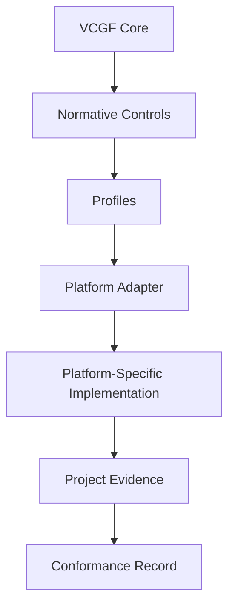

<!--
VCGF — Vibe Coding Governance Framework
SPDX-FileCopyrightText: 2026 Eng. Hamada Sami
SPDX-License-Identifier: Apache-2.0
Founder & Maintainer: Eng. Hamada Sami
Email: i@hamada.io
GitHub: https://github.com/Vibe-Coding-Commons
-->

# Architecture

VCGF separates policy from platform implementation. The logical Core is composed of `spec/`, `controls/`, `profiles/`, and `schemas/`; there is intentionally no redundant `core/` directory.

Controls have one canonical definition. Profiles select required outcomes. Adapters map those outcomes to verified platform surfaces and external enforcement. Evidence demonstrates project implementation.
